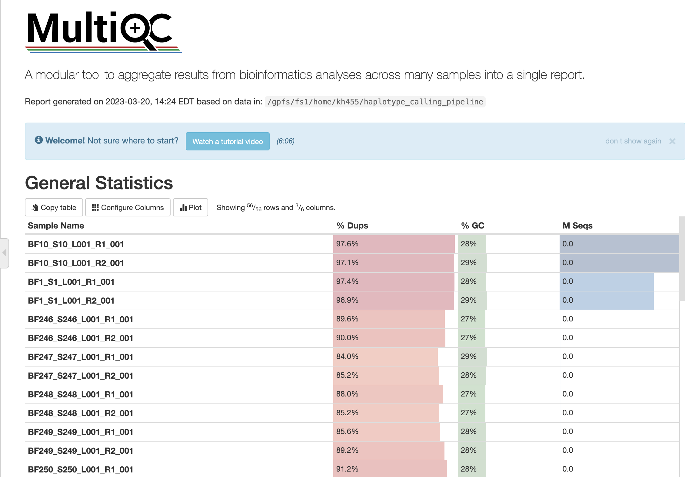

# Running the haplotype/variant calling pipeline with Snakemake

Overview: Using samples from amplicon deep sequencing from gene targets, either call haplotypes or call variants.

Method: Targeted amplicon deep sequencing which produces forward and reverse fastq files for each sample.

[Snakemake](https://snakemake.readthedocs.io/en/stable) is a workflow manager
that enables massively parallel and reproducible
analyses.
Snakemake is a suitable tool to use when you can break a workflow down into
discrete steps, with each step having input and output files.

We provide this example workflow as a template to get started running the pipeline with Snakemake.
To adjust to your specific data, you can customize the config.yaml file.

For more details on Snakemake, see the
[Snakemake tutorial](https://snakemake.readthedocs.io/en/stable/tutorial/tutorial.html).

## The Workflow

The [`Snakefile`](Snakefile) contains rules which define the output files we want and how to make them.
Snakemake automatically builds a directed acyclic graph (DAG) of jobs to figure
out the dependencies of each of the rules and what order to run them in.


The DAG shows how the pipeline can call haplotypes and call variants simultaneously, and how calls can be run in parallel if Snakemake is allowed to run more than one job at a time. Here, the pipeline is parallelized by being called with two targets each for haplotype and variant calling (AMA and CSP for haplotype calling, and PFCRT and PFMDR1 for variant calling) for and six quality scores (2, 5, 10, 15, 20, 25) at the same time.

`call_fastqc` uses FastQC to perform quality control on the raw reads and allow for visualization of the quality of the reads.

`call_trimmomatic` cleans and filters the raw reads. It uses CutAdapt to trim the primers and adapter sequences from sequencing reads and Trimmomatic to quality filter reads if the average of every 4 nucleotides had a Phred Quality Score < 15 or was less than 80 nucleotides long.

`generate_multiqc_report` uses the MultiQC reporting tool to parse summary statistics from results and log files generated by fastqc and cutadapt.

These first three rules are called for the given input data, regardless of whether the pipeline is being used to call haplotypes or call variants. Following this, the pipeline splits up into haplotype and/or variant calling.

`get_marker_lengths` calculates the length of each marker using the lengths of the reference and primer sequences.

`variant_calling` uses a package called Burrows-Wheeler Aligner, or BWA, which maps low-divergent sequences against a large reference genome. This is used for variant calling for drug resistance genes.

`analyze_vcf` takes in the vcf file(s) produced by the previous rule and returns a table of drug-resistance-associated mutations among the amplicon vcf file(s).

`combine_vcf_analysis` uses each target's table returned by `analyze_vcf` and combines them into a summary table that allows for easy analysis of the variant calling results.

`synchronize_reads` cleans, filters, and maps the raw reads. It uses BBmap to map all reads from the reference sequences, CutAdapt to trim the primers and adapter sequences from sequencing reads, and Trimmomatic to quality filter reads if the average of every 4 nucleotides had a Phred Quality Score < 15 or was less than 80 nucleotides long. This is the first step in read processing on the cluster.

`trim_and_filter` filters and trims the forward and reverse reads using the DADA2 program and outputs them into a `filtered` folder.

`optimize_reads` finds the quality score that produces the highest number of read counts and uses only the filtered reads created using that quality score.

`call_haplotypes` calls haplotypes for your target(s) and writes the results out into a reads table.

`censor_haplotypes` censors falsely detected haplotypes. Censoring criteria is applied in this order:
1. Haplotypes that occur in < 250 of the sample’s reads are removed. You can change this criteria in the config file ("read_depth").
2. Haplotypes that occur in < 3% of the sample’s reads are removed. You can change this criteria in the config file ("proportion").
3. Haplotypes that are a different length than the majority of haplotypes (300 nucleotides for pfama1, 288 nucleotides for pfcsp. You can change the length in the config file ("haplotype_length").
4. For haplotypes that have 1 SNP difference, occur in the same sample, and have a > 8 times read depth difference between them within that sample, removed the hapltoype with the lower read depth from that sample. You can change the 8 to a different read depth ratio in the config file ("read_depth_ratio").
5. If a haplotype is defined by a single variant position that is only variable within that haplotype, then it is removed.

`get_read_summaries` runs a bash script that pulls statistics from the summary files produced during the trim_and_filter rule for later manipulation in R.

`create_summaries` outputs csv files that summarizes the trim and read counts.

## Quick Start

1. Clone or download this repo.

    ``` sh
    git clone https://github.com/kathiehuang/haplotype_calling_pipeline.git
    ```
    Alternatively, if you're viewing this on GitHub,
    you can click the green `Use this template` button to create
    your own version of the repo on GitHub, then clone it.

1. Install the dependencies.

    1. If you don't have conda yet, we recommend installing 
       [miniconda](https://docs.conda.io/en/latest/miniconda.html). 
       
       If you use a Macbook that has an M1 Chip, you will need to install Rosetta2:

       ``` sh
       softwareupdate --install-rosetta
       ```

       Download the x86-64 bit version of miniconda instead of the M1 version.
       
    1. Next, install [mamba](https://mamba.readthedocs.io/en/latest/), 
       a fast drop-in replacement for conda:
       
       ``` sh
       conda install mamba -n base -c conda-forge
       ```
       
    1. Finally, create the environment and activate it:
    
       ``` sh
       mamba env create -f environment.yaml # you only have to do this once
       conda activate haplotype_calling # you have to do this every time
       ```
       
    - Alternatively, you can install the dependencies listed in
    [`environment.yaml`](environment.yaml) however you like.

1. Edit the configuration file [`config.yaml`](config.yaml).
    - `haplotype_calling_targets`: the list of target(s) you want to perform haplotype calling on.
    - `variant_calling_targets`: the list of target(s) you want to perform variant calling on.
    - `pair1`: the path to the folder containing the forward reads.
    - `pair2`: the path to the folder containing the reverse reads.
    - `trim_filter_out`: the path to the overall output folder, which will contain the output produced from trimming and filtering as well as the final output summary tables.
    - `refs`: the path to the folder containing reference sequences for the polymorphic gene target that will be used to map the raw reads to the appropriate gene targets of interest.
    - `forward`: the path to the file with the list of forward primers.
    - `rev`: the path to the file with the list of reverse primers.
    - `variant_table`: the path to the table that holds positions of interest for each target ran through variant calling.
    - `truncQ_values`: the list of values of truncQ to be used in the filterAndTrim function to find the optimal truncQ value.
    - `cutoff`: the cutoff for which samples with less than this number of reads after sampling should be removed.
    - `seed`: the seed of R's random number generator for the purpose of obtaining a reproducible random result.
    - `read_depth`: the cutoff for which haplotypes that occur in less than this amount of the sample reads should be removed.
    - `proportion`: the cutoff for which haplotypes that occur in less than this percentage of the sample reads should be removed.
    - `read_depth_ratio`: cutoff for which haplotypes that have 1 SNP difference, occur in the same sample, and have a greater than this amount times read depth difference between them within that sample with the lower read depth should be removed

    You can leave these options as-is if you'd like to first make sure the
    workflow runs without error on your machine before using your own dataset
    and custom parameters.

1. Modify your adapters files to notify CutAdapt that you want to use linked adapters.

    A linked adapter combines a 5’ and a 3’ adapter, so we use this if a sequence is surrounded by a 5’ and a 3’ adapter and we want to remove both adapters. Linked adapters aren't required for this pipeline to run, but we found that for our data, using linked adapters produced better results.

    Linked adapters are specified as two sequences separated by ... (three dots), with the second sequence being the reverse complement of the reverse primer for the forward primer and the reverse complement of the forward primer for the reverse primer. We use -g instead of -a (5' vs 3' adapters) when calling CutAdapt, which causes both adapters to be required, even if they are not anchored. However, we want the non-anchored adapters to be optional. You can mark each adapter explicitly as required or optional using the search parameters `required` and `optional`. As a result, we add the `optional` parameter to the end of the sequence after the three dots. This is what our `forwardPrimers.fasta` file looks like for CSP:

    ``` sh
    >Pfcsp-f
    TTAAGGAACAAGAAGGATAATACCA...CATTTCGGTTTGGGTCATTT;optional
    ```

    And our `reversePrimers.fasta` file looks like this:

    ``` sh
    >Pfcsp-r_rc
    AAATGACCCAAACCGAAATG...TGGTATTATCCTTCTTGTTCCTTAA;optional
    ```

    If you choose to forgo using linked adapters, this is what your adapters file would look like:

    ``` sh
    >Pfcsp-f
    TTAAGGAACAAGAAGGATAATACCA
    ```

    ``` sh
    >Pfcsp-r_rc
    AAATGACCCAAACCGAAATG
    ```

    For more information about the linked adapters parameter, visit the [CutAdapt documentation.](https://cutadapt.readthedocs.io/en/stable/guide.html#linked-adapters-combined-5-and-3-adapter)

1. Do a dry run to make sure the snakemake workflow is valid.

    ``` sh
    snakemake -n
    ```

1. Run the workflow.

    Run it **locally** with:
    ``` sh
    snakemake --cores {NCORES} # NCORES = number of cores, ie. without parallelization use snakemake --cores 1. You can use snakemake -n to see how many jobs you'll need given the number of targets and quality scores you put in the config file.
    ```

    To run the workflow on an **HPC with Slurm**:

    1. Edit your email address (`YOUR_EMAIL_HERE`) in:

        - [`scripts/submit_slurm.sh`](scripts/submit_slurm.sh)

    1. Edit the number of cores you want to use for this pipeline run (right now it is defaulted to 12 cores).

    1. Submit the snakemake workflow with:

        ``` sh
        sbatch scripts/submit_slurm.sh
        ```

        Slurm output files will be written to `logs/`. You will receive an email when the job is finished.

## Usage Examples

Below shows what output files looked like after running this pipeline with a small sample of haplotypes.

`call_fastqc` should produce an output folder `{trim_filter_out}`. Within the output folder, there should be a `fastqc_in` folder with FastQC reports for each input fastq file. This allows you to visualize and assess quality collectively across all reads within a sample. To open the .zip files, download and extract the files.

Example of FastQC output files for a single sample: `BF1_S1_L001_R1_001_fastqc.html`, `BF1_S1_L001_R1_001_fastqc.zip`, `BF1_S1_L001_R2_001_fastqc.html`, `BF1_S1_L001_R2_001_fastqc.zip`

`call_trimmomatic` should add a `trim` folder within the output directory containing the results from the Trimmomatic program, which filters poor quality reads and trims poor quality bases from your samples and produces statistical summaries.

The `trim` folder contains four folders labeled `1`, `2`, `singleton`, and `summaries`. As an example, the `trim/1` folder contains a `BF1.1.fastq.gz` file, the `trim/2` folder contains a `BF1.2.fastq.gz` file, the `singleton` folder contains `BF1.1_unpaired.fq.gz` and `BF1.2_unpaired.fq.gz` files, and the `summaries` folder contains a `BF1.summary` file.

`generate_multiqc_report` should create a file `multiqc_report.html` in the output directory. If you download this file to your local computer, you can open it in a browser to see the aggregated results as an HTML report.



### Variant Calling

`variant_calling` should create a directory for each target, with each directory containing four folders: `bam`, `sam`, `sort_bam`, and `vcf`.

`analyze_vcf` should temporarily create a file called `DR_mutations.csv` in the output directory for each target. After running the pipeline on a small set of samples, the PFCRT table looked like this:

|FIELD1|Target|Sample|POS|REF|ALT|ALT_DEPTH|DEPTH|ALT_FREQ|
|------|------|------|---|---|---|---------|-----|--------|
|0     |PFCRT |BF252 |404|A  |.  |0        |11   |0.0     |
|1     |PFCRT |BF252 |454|A  |.  |0        |11   |0.0     |
|2     |PFCRT |BF252 |466|C  |.  |0        |12   |0.0     |
|3     |PFCRT |BF252 |610|C  |.  |0        |7    |0.0     |

`combine_vcf_analysis` should create a file called `dr_depths_freqs.csv` in the output directory. After running the pipeline on a small set of samples with targets PFCRT and PFMDR1, our depths frequency table looked like this:

|Target|Sample|POS|BASE|TOTAL_DEPTH|DEPTH|FREQ                |
|------|------|---|----|-----------|-----|--------------------|
|PFMDR1|BF246 |57 |T   |111        |34   |0.3063063063063063  |
|PFMDR1|BF259 |57 |T   |115        |64   |0.5565217391304348  |
|PFMDR1|BF260 |57 |T   |89         |64   |0.7191011235955056  |
|PFMDR1|BF261 |57 |T   |139        |67   |0.48201438848920863 |
|PFMDR1|BF262 |57 |T   |125        |96   |0.768               |
|PFMDR1|BF263 |57 |T   |137        |127  |0.927007299270073   |
|PFMDR1|BF246 |352|T   |116        |116  |1                   |
|PFMDR1|BF247 |352|T   |68         |68   |1                   |
|PFMDR1|BF248 |352|T   |119        |119  |1                   |
|PFMDR1|BF249 |352|T   |88         |88   |1                   |
|PFMDR1|BF251 |352|T   |99         |99   |1                   |
|PFMDR1|BF252 |352|T   |84         |67   |0.7976190476190477  |
|PFMDR1|BF254 |352|T   |80         |80   |1                   |
|PFMDR1|BF255 |352|T   |108        |108  |1                   |
|PFMDR1|BF257 |352|T   |79         |78   |0.9873417721518988  |
|PFMDR1|BF259 |352|T   |118        |49   |0.4152542372881356  |
|PFMDR1|BF261 |352|T   |143        |43   |0.3006993006993007  |
|PFMDR1|BF246 |57 |A   |111        |77   |0.6936936936936937  |
|PFMDR1|BF259 |57 |A   |115        |51   |0.4434782608695652  |
|PFMDR1|BF260 |57 |A   |89         |25   |0.2808988764044944  |
|PFMDR1|BF261 |57 |A   |139        |72   |0.5179856115107914  |
|PFMDR1|BF262 |57 |A   |125        |29   |0.23199999999999998 |
|PFMDR1|BF263 |57 |A   |137        |10   |0.07299270072992703 |
|PFMDR1|BF246 |352|A   |116        |0    |0                   |
|PFMDR1|BF247 |352|A   |68         |0    |0                   |
|PFMDR1|BF248 |352|A   |119        |0    |0                   |
|PFMDR1|BF249 |352|A   |88         |0    |0                   |
|PFMDR1|BF251 |352|A   |99         |0    |0                   |
|PFMDR1|BF252 |352|A   |84         |17   |0.20238095238095233 |
|PFMDR1|BF254 |352|A   |80         |0    |0                   |
|PFMDR1|BF255 |352|A   |108        |0    |0                   |
|PFMDR1|BF257 |352|A   |79         |1    |0.012658227848101222|
|PFMDR1|BF259 |352|A   |118        |69   |0.5847457627118644  |
|PFMDR1|BF261 |352|A   |143        |100  |0.6993006993006994  |
|PFMDR1|BF247 |57 |A   |67         |67   |1                   |
|PFMDR1|BF248 |57 |A   |118        |118  |1                   |
|PFMDR1|BF249 |57 |A   |88         |88   |1                   |
|PFMDR1|BF250 |57 |A   |81         |81   |1                   |
|PFMDR1|BF251 |57 |A   |95         |95   |1                   |
|PFMDR1|BF252 |57 |A   |85         |85   |1                   |
|PFMDR1|BF253 |57 |A   |103        |103  |1                   |
|PFMDR1|BF254 |57 |A   |79         |79   |1                   |
|PFMDR1|BF255 |57 |A   |105        |105  |1                   |
|PFMDR1|BF256 |57 |A   |121        |121  |1                   |
|PFMDR1|BF257 |57 |A   |79         |79   |1                   |
|PFMDR1|BF258 |57 |A   |94         |94   |1                   |
|PFMDR1|BF250 |352|A   |82         |82   |1                   |
|PFMDR1|BF253 |352|A   |102        |102  |1                   |
|PFMDR1|BF256 |352|A   |121        |121  |1                   |
|PFMDR1|BF258 |352|A   |95         |95   |1                   |
|PFMDR1|BF260 |352|A   |96         |96   |1                   |
|PFMDR1|BF262 |352|A   |126        |126  |1                   |
|PFMDR1|BF263 |352|A   |142        |142  |1                   |
|PFCRT |BF252 |404|A   |11         |11   |1                   |
|PFCRT |BF252 |454|A   |11         |11   |1                   |
|PFCRT |BF252 |466|C   |12         |12   |1                   |
|PFCRT |BF252 |610|C   |7          |7    |1                   |

### Haplotype Calling

`get_marker_lengths` should add a csv file containing the names of each marker and their corresponding lengths called `marker_lengths.csv` to the output directory.

`synchronize_reads` should create a directory for each target, with each directory containing three folders: `fastq/all_samples`, `ref`, and `results`. `all_samples` contains the cleaned and mapped fastq files, `ref` contains information about the indexes produced and referenced by the BBSplit program, and `results` contains summaries of the BBSplit call on each sample.

As an example, for AMA, the `fastq/all_samples` folder contains `BF1_AMA_1.fastq.gz` and `BF1_AMA_2.fastq.gz` files, the `ref` folder contains a `genome/1` folder that has `merged_ref_64917.fa.gz`, `namelist.txt`, and `reflist.txt` files, and `results` contains a `BF1.txt` file.

`trim_and_filter` should produce a `haplotype_output` folder in each target's directory that contains a summary for read trimming and filtering for each q value (which can be changed in the config file), `{target}_{q_values}_trimAndFilterTable`. It also produces a `{target}/read_count` file that lists the read counts for each q value.

After running the pipeline on a small sample of haplotypes, the AMA trim and filter table for a q value of 2 looked like this:

|                      | reads.in | reads.out |
|----------------------|----------|-----------|
| BF1_AMA_1.fastq.gz   | 13072    | 8297      |
| BF10_AMA_1.fastq.gz  | 14875    | 9243      |
| BF2_AMA_1.fastq.gz   | 15269    | 10247     |
| BF3_AMA_1.fastq.gz   | 10116    | 5075      |
| BF4_AMA_1.fastq.gz   | 13672    | 8852      |
| BF5_AMA_1.fastq.gz   | 12650    | 7720      |
| BF6_AMA_1.fastq.gz   | 14591    | 9754      |
| BF7_AMA_1.fastq.gz   | 12760    | 8208      |
| BF8_AMA_1.fastq.gz   | 11474    | 7382      |
| BF9_AMA_1.fastq.gz   | 12432    | 6318      |

And the AMA read count table looked like this:

|   |   |
|---|---|
| 25 | 76565  |
| 15 | 103295 |
| 20 | 103224 |
| 2  | 81096  |
| 5  | 81096  |
| 10 | 116036 |

`optimize_reads` should produce 3 files in the `haplotype_output` folder: `{target}_final_q_value`, `{target}_max_read_count`, and `{target}_finalTrimAndFilterTable`.
- `{target}_final_q_value`: contains the quality score that produced the highest number of read counts.
- `{target}_max_read_count`: contains the value of the highest number of read counts—the read count associated with the optimal quality score.
- `{target}_finalTrimAndFilterTable`: contains the trim and filter table that was created with the optimal quality score.

With our small sample, the AMA final q value was:
`10`

The AMA max read count was:
`116036`

And the final AMA trim and filter table looked like this:

|                     | reads.in | reads.out |
|---------------------|----------|-----------|
| BF1_AMA_1.fastq.gz  | 13072    | 11777     |
| BF10_AMA_1.fastq.gz | 14875    | 13384     |
| BF2_AMA_1.fastq.gz  | 15269    | 13718     |
| BF3_AMA_1.fastq.gz  | 10116    | 8491      |
| BF4_AMA_1.fastq.gz  | 13672    | 12226     |
| BF5_AMA_1.fastq.gz  | 12650    | 11119     |
| BF6_AMA_1.fastq.gz  | 14591    | 13085     |
| BF7_AMA_1.fastq.gz  | 12760    | 11350     |
| BF8_AMA_1.fastq.gz  | 11474    | 10326     |
| BF9_AMA_1.fastq.gz  | 12432    | 10560     |

`call_haplotypes` should add two files to the `haplotype_output` folder: `{target}_haplotypes.rds` and `{target}_trackReadsThroughPipeline.csv`. 
- `{target}_haplotypes.rds`: R file that stores the haplotype results data set for further manipulation in `censor_haplotypes`. 
- `{target}_trackReadsThroughPipeline.csv`: tracks the reads, looking at the number of reads that made it through each step of the pipeline.

With our small sample, the trackReadsThroughPipeline table for AMA looked like this:

|      | merged | tabled | nonchim |
|------|--------|--------|---------|
| BF1  | 11768  | 11768  | 11768   |
| BF10 | 13377  | 13377  | 13377   |
| BF2  | 13681  | 13681  | 13681   |
| BF3  | 8450   | 8450   | 8450    |
| BF4  | 12211  | 12211  | 12211   |
| BF5  | 10584  | 10584  | 10360   |
| BF6  | 13078  | 13078  | 13078   |
| BF7  | 11049  | 11049  | 10773   |
| BF8  | 10314  | 10314  | 10314   |
| BF9  | 10549  | 10549  | 10549   |

`censor_haplotypes` should add six files to the haplotype_output folder: `{target}_haplotype_table_precensored.csv`, `{target}_snps_between_haps_within_samples.fasta`, `{target}_uniqueSeqs.fasta`, `{target}_aligned_seqs.fasta`, `{target}_uniqueSeqs_final_censored.fasta`, and `{target}_haplotype_table_censored_final_version.csv`. 
- `{target}_haplotype_table_precensored.csv`: outputs the haplotype data set prior to beginning the censoring process (essentially `{target}_haplotypes.rds` in a formatted csv file). 
- `{target}_snps_between_haps_within_samples.fasta`: fasta file of the haplotypes after the first three steps of the censoring process are completed. This is used to tally up the number of SNPs between all haplotype pairings. 
- `{target}_uniqueSeqs.fasta`: fasta file of the haplotypes after the fourth step of the censoring process is completed. 
- `{target}_aligned_seqs.fasta`: fasta file of the sequences after alignment. 
- `{target}_uniqueSeqs_final_censored.fasta`: fasta file of the haplotype results after all five steps of the censoring process are completed. 
- `{target}_haplotype_table_censored_final_version.csv`: outputs the final censored haplotype data set in a formatted table.

With our small sample, the AMA haplotype_table_precensored file looked like this:

| H1    | H2    | H3    | H4    | H5    | H6    | H7    | MiSeq.ID |
|-------|-------|-------|-------|-------|-------|-------|----------|
| 0     | 0     | 0     | 0     | 11768 | 0     | 0     | BF1      |
| 0     | 0     | 0     | 13377 | 0     | 0     | 0     | BF10     |
| 13665 | 0     | 0     | 16    | 0     | 0     | 0     | BF2      |
| 0     | 8450  | 0     | 0     | 0     | 0     | 0     | BF3      |
| 18    | 12186 | 7     | 0     | 0     | 0     | 0     | BF4      |
| 268   | 0     | 9862  | 0     | 0     | 230   | 0     | BF5      |
| 13078 | 0     | 0     | 0     | 0     | 0     | 0     | BF6      |
| 0     | 603   | 10170 | 0     | 0     | 0     | 0     | BF7      |
| 0     | 0     | 0     | 0     | 0     | 10314 | 0     | BF8      |
| 51    | 0     | 0     | 0     | 0     | 0     | 10498 | BF9      |

The AMA snps_between_haps_within_samples file looked like this:
```
>Seq1
GTAAAGGTATAATTATTGAGAATTCAAATACTACTTTTTTAACACCGGTAGCTACGGGAAATCAATATTTAAAAGATGGAGGTTTTGCTTTTCCTCCAACAGAACCTCATATGTCACCAATGACATTAGATGAAATGAGACATTTTTATAAAGATAATAAATATGTAAAAAATTTAGATGAATTGACTTTATGTTCAAGACATGCAGGAAATATGATTCCAGATAATGATAAAAATTCAAATTATAAATATCCAGCTGTTTATGATGACAAAGATAAAAAGTGTCATATATTATATATTG
>Seq2
GTAAAGGTATAATTATTGAGAATTCAAATACTACTTTTTTAAAACCGGTAGCTACGGGAAATCAAGATTTAAAAGATGGAGGTTTTGCTTTTCCTCCAACAAATCCTCTTATATCACCAATGACATTAAATGGTATGAGAGATTTTTATAAAAATAATGAATATGTAAAAAATTTAGATGAATTGACTTTATGTTCAAGACATGCAGGAAATATGAATCCAGATAATGATGAAAATTCAAATTATAAATATCCAGCTGTTTATGATGACAAAGATAAAAAGTGTCATATATTATATATTG
>Seq3
GTAAAGGTATAATTATTGAGAATTCAAATACTACTTTTTTAAAACCGGTAGCTACGGGAAATCAAGATTTAAAAGATGGAGGTTTTGCTTTTCCTCCAACAGAACCTCTTATATCACCAATGACATTAGATGATATGAGAGATTTTTATAAAAATAATGAATATGTAAAAAATTTAGATGAATTGACTTTATGTTCAAGACATGCAGGAAATATGAATCCAGATAATGATCAAAATTCAAATTATAAATATCCAGCTGTTTATGATTACGAAGATAAAAAGTGTCATATATTATATATTG
>Seq4
GTAAAGGTATAATTATTGAGAATTCAAATACTACTTTTTTAACACCGGTAGCTACGGGAAAACAAGATTTAAAAGATGGAGGTTTTGCTTTTCCTCCAACAAATCCTCTTATATCACCAATGACATTAGATCATATGAGAGATTTTTATAAAAAAAATGAATATGTAAAAAATTTAGATGAATTGACTTTATGTTCAAGACATGCAGGAAATATGAATCCAGATAATGATGAAAATTCAAATTATAAATATCCAGCTGTTTATGATTACAAAGATAAAAAGTGTCATATATTATATATTG
>Seq5
GTAAAGGTATAATTATTGAGAATTCAAATACTACTTTTTTAAAACCGGTAGCTACGGGAAATCAAGATTTAAAAGATGGAGGTTTTGCTTTTCCTCCAACAGAACCTCTTATATCACCAATGACATTAAATGGTATGAGAGATTTATATAAAAATAATGAAGATGTAAAAAATTTAGATGAATTGACTTTATGTTCAAGACATGCAGGAAATATGAATCCAGATAATGATAAAAATTCAAATTATAAATATCCAGCTGTTTATGATGACAAAAATAAAAAGTGTCATATATTATATATTG
>Seq6
GTAAAGGTATAATTATTGAGAATTCAAAAACTACTTTTTTAACACCGGTAGCTACGGAAAATCAAGATTTAAAAGATGGAGGTTTTGCTTTTCCTCCAACAAATCCTCCTATGTCACCAATGACATTAAATGGTATGAGAGATTTATATAAAAATAATGAATATGTAAAAAATTTAGATGAATTGACTTTATGTTCAAGACATGCAGGAAATATGAATCCAGATAATGATAAAAATTCAAATTATAAATATCCAGCTGTTTATGATTACAATGATAATAAGTGTCATATATTATATATTG
>Seq7
GTAAAGGTATAATTATTGAGAATTCAAATACTACTTTTTTAAAACCGGTAGCTACGGGAAATCAAGATTTAAAAGATGGAGGTTTTGCTTTTCCTCCAACAGAACCTCTTATATCACCAATGACATTAAATGGTATGAGAGATTTTTATAAAAATAATGAATATGTAAAAAATTTAGATGAATTGACTTTATGTTCAAGACATGCAGGAAATATGAATCCAGATAAGGATGAAAATTCAAATTATAAATATCCAGCTGTTTATGATGACAAAGATAAAAAGTGTCATATATTATATATTG
```

The AMA uniqueSeqs file looked like this: 
```
>Seq1
GTAAAGGTATAATTATTGAGAATTCAAATACTACTTTTTTAACACCGGTAGCTACGGGAAATCAATATTTAAAAGATGGAGGTTTTGCTTTTCCTCCAACAGAACCTCATATGTCACCAATGACATTAGATGAAATGAGACATTTTTATAAAGATAATAAATATGTAAAAAATTTAGATGAATTGACTTTATGTTCAAGACATGCAGGAAATATGATTCCAGATAATGATAAAAATTCAAATTATAAATATCCAGCTGTTTATGATGACAAAGATAAAAAGTGTCATATATTATATATTG
>Seq2
GTAAAGGTATAATTATTGAGAATTCAAATACTACTTTTTTAAAACCGGTAGCTACGGGAAATCAAGATTTAAAAGATGGAGGTTTTGCTTTTCCTCCAACAAATCCTCTTATATCACCAATGACATTAAATGGTATGAGAGATTTTTATAAAAATAATGAATATGTAAAAAATTTAGATGAATTGACTTTATGTTCAAGACATGCAGGAAATATGAATCCAGATAATGATGAAAATTCAAATTATAAATATCCAGCTGTTTATGATGACAAAGATAAAAAGTGTCATATATTATATATTG
>Seq3
GTAAAGGTATAATTATTGAGAATTCAAATACTACTTTTTTAAAACCGGTAGCTACGGGAAATCAAGATTTAAAAGATGGAGGTTTTGCTTTTCCTCCAACAGAACCTCTTATATCACCAATGACATTAGATGATATGAGAGATTTTTATAAAAATAATGAATATGTAAAAAATTTAGATGAATTGACTTTATGTTCAAGACATGCAGGAAATATGAATCCAGATAATGATCAAAATTCAAATTATAAATATCCAGCTGTTTATGATTACGAAGATAAAAAGTGTCATATATTATATATTG
>Seq4
GTAAAGGTATAATTATTGAGAATTCAAATACTACTTTTTTAACACCGGTAGCTACGGGAAAACAAGATTTAAAAGATGGAGGTTTTGCTTTTCCTCCAACAAATCCTCTTATATCACCAATGACATTAGATCATATGAGAGATTTTTATAAAAAAAATGAATATGTAAAAAATTTAGATGAATTGACTTTATGTTCAAGACATGCAGGAAATATGAATCCAGATAATGATGAAAATTCAAATTATAAATATCCAGCTGTTTATGATTACAAAGATAAAAAGTGTCATATATTATATATTG
>Seq5
GTAAAGGTATAATTATTGAGAATTCAAATACTACTTTTTTAAAACCGGTAGCTACGGGAAATCAAGATTTAAAAGATGGAGGTTTTGCTTTTCCTCCAACAGAACCTCTTATATCACCAATGACATTAAATGGTATGAGAGATTTATATAAAAATAATGAAGATGTAAAAAATTTAGATGAATTGACTTTATGTTCAAGACATGCAGGAAATATGAATCCAGATAATGATAAAAATTCAAATTATAAATATCCAGCTGTTTATGATGACAAAAATAAAAAGTGTCATATATTATATATTG
>Seq6
GTAAAGGTATAATTATTGAGAATTCAAAAACTACTTTTTTAACACCGGTAGCTACGGAAAATCAAGATTTAAAAGATGGAGGTTTTGCTTTTCCTCCAACAAATCCTCCTATGTCACCAATGACATTAAATGGTATGAGAGATTTATATAAAAATAATGAATATGTAAAAAATTTAGATGAATTGACTTTATGTTCAAGACATGCAGGAAATATGAATCCAGATAATGATAAAAATTCAAATTATAAATATCCAGCTGTTTATGATTACAATGATAATAAGTGTCATATATTATATATTG
>Seq7
GTAAAGGTATAATTATTGAGAATTCAAATACTACTTTTTTAAAACCGGTAGCTACGGGAAATCAAGATTTAAAAGATGGAGGTTTTGCTTTTCCTCCAACAGAACCTCTTATATCACCAATGACATTAAATGGTATGAGAGATTTTTATAAAAATAATGAATATGTAAAAAATTTAGATGAATTGACTTTATGTTCAAGACATGCAGGAAATATGAATCCAGATAAGGATGAAAATTCAAATTATAAATATCCAGCTGTTTATGATGACAAAGATAAAAAGTGTCATATATTATATATTG
```

The AMA aligned_seqs file looked like this:

```
>Seq5
GTAAAGGTATAATTATTGAGAATTCAAATACTACTTTTTTAAAACCGGTAGCTACGGGAAATCAAGATTTAAAAGATGGA
GGTTTTGCTTTTCCTCCAACAGAACCTCTTATATCACCAATGACATTAAATGGTATGAGAGATTTATATAAAAATAATGA
AGATGTAAAAAATTTAGATGAATTGACTTTATGTTCAAGACATGCAGGAAATATGAATCCAGATAATGATAAAAATTCAA
ATTATAAATATCCAGCTGTTTATGATGACAAAAATAAAAAGTGTCATATATTATATATTG
>Seq6
GTAAAGGTATAATTATTGAGAATTCAAAAACTACTTTTTTAACACCGGTAGCTACGGAAAATCAAGATTTAAAAGATGGA
GGTTTTGCTTTTCCTCCAACAAATCCTCCTATGTCACCAATGACATTAAATGGTATGAGAGATTTATATAAAAATAATGA
ATATGTAAAAAATTTAGATGAATTGACTTTATGTTCAAGACATGCAGGAAATATGAATCCAGATAATGATAAAAATTCAA
ATTATAAATATCCAGCTGTTTATGATTACAATGATAATAAGTGTCATATATTATATATTG
>Seq4
GTAAAGGTATAATTATTGAGAATTCAAATACTACTTTTTTAACACCGGTAGCTACGGGAAAACAAGATTTAAAAGATGGA
GGTTTTGCTTTTCCTCCAACAAATCCTCTTATATCACCAATGACATTAGATCATATGAGAGATTTTTATAAAAAAAATGA
ATATGTAAAAAATTTAGATGAATTGACTTTATGTTCAAGACATGCAGGAAATATGAATCCAGATAATGATGAAAATTCAA
ATTATAAATATCCAGCTGTTTATGATTACAAAGATAAAAAGTGTCATATATTATATATTG
>Seq1
GTAAAGGTATAATTATTGAGAATTCAAATACTACTTTTTTAACACCGGTAGCTACGGGAAATCAATATTTAAAAGATGGA
GGTTTTGCTTTTCCTCCAACAGAACCTCATATGTCACCAATGACATTAGATGAAATGAGACATTTTTATAAAGATAATAA
ATATGTAAAAAATTTAGATGAATTGACTTTATGTTCAAGACATGCAGGAAATATGATTCCAGATAATGATAAAAATTCAA
ATTATAAATATCCAGCTGTTTATGATGACAAAGATAAAAAGTGTCATATATTATATATTG
>Seq2
GTAAAGGTATAATTATTGAGAATTCAAATACTACTTTTTTAAAACCGGTAGCTACGGGAAATCAAGATTTAAAAGATGGA
GGTTTTGCTTTTCCTCCAACAAATCCTCTTATATCACCAATGACATTAAATGGTATGAGAGATTTTTATAAAAATAATGA
ATATGTAAAAAATTTAGATGAATTGACTTTATGTTCAAGACATGCAGGAAATATGAATCCAGATAATGATGAAAATTCAA
ATTATAAATATCCAGCTGTTTATGATGACAAAGATAAAAAGTGTCATATATTATATATTG
>Seq3
GTAAAGGTATAATTATTGAGAATTCAAATACTACTTTTTTAAAACCGGTAGCTACGGGAAATCAAGATTTAAAAGATGGA
GGTTTTGCTTTTCCTCCAACAGAACCTCTTATATCACCAATGACATTAGATGATATGAGAGATTTTTATAAAAATAATGA
ATATGTAAAAAATTTAGATGAATTGACTTTATGTTCAAGACATGCAGGAAATATGAATCCAGATAATGATCAAAATTCAA
ATTATAAATATCCAGCTGTTTATGATTACGAAGATAAAAAGTGTCATATATTATATATTG
>Seq7
GTAAAGGTATAATTATTGAGAATTCAAATACTACTTTTTTAAAACCGGTAGCTACGGGAAATCAAGATTTAAAAGATGGA
GGTTTTGCTTTTCCTCCAACAGAACCTCTTATATCACCAATGACATTAAATGGTATGAGAGATTTTTATAAAAATAATGA
ATATGTAAAAAATTTAGATGAATTGACTTTATGTTCAAGACATGCAGGAAATATGAATCCAGATAAGGATGAAAATTCAA
ATTATAAATATCCAGCTGTTTATGATGACAAAGATAAAAAGTGTCATATATTATATATTG
```

The AMA uniqueSeqs_final_censored file looked like this:
```
>Seq1
GTAAAGGTATAATTATTGAGAATTCAAATACTACTTTTTTAAAACCGGTAGCTACGGGAAATCAAGATTTAAAAGATGGAGGTTTTGCTTTTCCTCCAACAAATCCTCTTATATCACCAATGACATTAAATGGTATGAGAGATTTTTATAAAAATAATGAATATGTAAAAAATTTAGATGAATTGACTTTATGTTCAAGACATGCAGGAAATATGAATCCAGATAATGATGAAAATTCAAATTATAAATATCCAGCTGTTTATGATGACAAAGATAAAAAGTGTCATATATTATATATTG
```

And the AMA haplotype_table_censored_final table looked like this:

| H2    | MiSeq.ID |
|-------|----------|
| 8450  | BF3      |
| 12186 | BF4      |
| 603   | BF7      |

`get_read_summaries` should produce 4 files in the `{trim_filter_out}` folder: `trim_summaries`, `trim_summary_names`, `pre-filt_fastq_read_counts`, and `filt_fastq_read_counts`.
- `trim_summaries` consolidates all the `{out}/trim/summaries` data into one file.
- `trim_summary_names` contains all the file names in `{out}/trim/summaries`.
- `pre-filt_fastq_read_counts` contains the read counts prior to filtering.
- `filt-fastq_read_counts` contains the read counts after filtering.

With our small sample, one of the consolidated trim summaries looked like this:

```
Input Read Pairs: 33577
Both Surviving Reads: 32298
Both Surviving Read Percent: 96.19
Forward Only Surviving Reads: 454
Forward Only Surviving Read Percent: 1.35
Reverse Only Surviving Reads: 659
Reverse Only Surviving Read Percent: 1.96
Dropped Reads: 166
Dropped Read Percent: 0.49
```

The trim summary names file looked like this:

```
BF10.summary
BF1.summary
BF246.summary
BF247.summary
BF248.summary
BF249.summary
BF250.summary
BF251.summary
BF252.summary
BF253.summary
BF254.summary
BF255.summary
BF256.summary
BF257.summary
BF258.summary
BF259.summary
BF260.summary
BF261.summary
BF262.summary
BF263.summary
BF2.summary
BF3.summary
BF4.summary
BF5.summary
BF6.summary
BF7.summary
BF8.summary
BF9.summary
```

Some of the pre-filtered read counts looked like this:

```
AMA/out/fastq/all_samples/BF10_AMA_1.fastq.gz	14875
AMA/out/fastq/all_samples/BF10_AMA_2.fastq.gz	14875
AMA/out/fastq/all_samples/BF1_AMA_1.fastq.gz	13072
AMA/out/fastq/all_samples/BF1_AMA_2.fastq.gz	13072
AMA/out/fastq/all_samples/BF2_AMA_1.fastq.gz	15269
AMA/out/fastq/all_samples/BF2_AMA_2.fastq.gz	15269
AMA/out/fastq/all_samples/BF3_AMA_1.fastq.gz	10116
AMA/out/fastq/all_samples/BF3_AMA_2.fastq.gz	10116
```

And some of the filtered read counts looked like this:

```
AMA/out/fastq/all_samples/final_filtered/BF10_final_F_filt.fastq.gz	13384
AMA/out/fastq/all_samples/final_filtered/BF10_final_R_filt.fastq.gz	13384
AMA/out/fastq/all_samples/final_filtered/BF1_final_F_filt.fastq.gz	11777
AMA/out/fastq/all_samples/final_filtered/BF1_final_R_filt.fastq.gz	11777
AMA/out/fastq/all_samples/final_filtered/BF2_final_F_filt.fastq.gz	13718
AMA/out/fastq/all_samples/final_filtered/BF2_final_R_filt.fastq.gz	13718
AMA/out/fastq/all_samples/final_filtered/BF3_final_F_filt.fastq.gz	8491
AMA/out/fastq/all_samples/final_filtered/BF3_final_R_filt.fastq.gz	8491
```

`create_summaries` should produce 2 files in the `{trim_filter_out}` folder: `long_summary` and `wide_summary`. `long_summary` is a csv file that summarizes the read counts with columns read_type, read_ct, sample, and target. This allows for easy manipulation of the dataframe if needed in the future. `wide_summary` is a csv file that summarizes the read counts with each row being a sample. This allows for easy visualization of the data analysis to see how each sample did throughout the workflow.

With our small samples of AMA and CSP, the long summary looked like this:

|read_type|read_ct|sample|target|
|---------|-------|------|------|
|Input Read Pairs|33577  |BF10  |NA    |
|Both Surviving Reads|32298  |BF10  |NA    |
|Forward Only Surviving Reads|454    |BF10  |NA    |
|Reverse Only Surviving Reads|659    |BF10  |NA    |
|Dropped Reads|166    |BF10  |NA    |
|Input Read Pairs|26485  |BF1   |NA    |
|Both Surviving Reads|25565  |BF1   |NA    |
|Forward Only Surviving Reads|359    |BF1   |NA    |
|Reverse Only Surviving Reads|461    |BF1   |NA    |
|Dropped Reads|100    |BF1   |NA    |
|Input Read Pairs|28008  |BF2   |NA    |
|Both Surviving Reads|26932  |BF2   |NA    |
|Forward Only Surviving Reads|412    |BF2   |NA    |
|Reverse Only Surviving Reads|516    |BF2   |NA    |
|Dropped Reads|148    |BF2   |NA    |
|Input Read Pairs|25840  |BF3   |NA    |
|Both Surviving Reads|24730  |BF3   |NA    |
|Forward Only Surviving Reads|443    |BF3   |NA    |
|Reverse Only Surviving Reads|504    |BF3   |NA    |
|Dropped Reads|163    |BF3   |NA    |
|Input Read Pairs|29520  |BF4   |NA    |
|Both Surviving Reads|28500  |BF4   |NA    |
|Forward Only Surviving Reads|392    |BF4   |NA    |
|Reverse Only Surviving Reads|546    |BF4   |NA    |
|Dropped Reads|82     |BF4   |NA    |
|Input Read Pairs|30472  |BF5   |NA    |
|Both Surviving Reads|29347  |BF5   |NA    |
|Forward Only Surviving Reads|455    |BF5   |NA    |
|Reverse Only Surviving Reads|533    |BF5   |NA    |
|Dropped Reads|137    |BF5   |NA    |
|Input Read Pairs|32025  |BF6   |NA    |
|Both Surviving Reads|30863  |BF6   |NA    |
|Forward Only Surviving Reads|444    |BF6   |NA    |
|Reverse Only Surviving Reads|591    |BF6   |NA    |
|Dropped Reads|127    |BF6   |NA    |
|Input Read Pairs|29455  |BF7   |NA    |
|Both Surviving Reads|28429  |BF7   |NA    |
|Forward Only Surviving Reads|391    |BF7   |NA    |
|Reverse Only Surviving Reads|524    |BF7   |NA    |
|Dropped Reads|111    |BF7   |NA    |
|Input Read Pairs|27293  |BF8   |NA    |
|Both Surviving Reads|26279  |BF8   |NA    |
|Forward Only Surviving Reads|303    |BF8   |NA    |
|Reverse Only Surviving Reads|609    |BF8   |NA    |
|Dropped Reads|102    |BF8   |NA    |
|Input Read Pairs|26675  |BF9   |NA    |
|Both Surviving Reads|25541  |BF9   |NA    |
|Forward Only Surviving Reads|477    |BF9   |NA    |
|Reverse Only Surviving Reads|514    |BF9   |NA    |
|Dropped Reads|143    |BF9   |NA    |
|filt     |11777  |BF1   |ama   |
|prefilt  |13072  |BF1   |ama   |
|filt     |11352  |BF1   |csp   |
|prefilt  |12491  |BF1   |csp   |
|filt     |13384  |BF10  |ama   |
|prefilt  |14875  |BF10  |ama   |
|filt     |15886  |BF10  |csp   |
|prefilt  |17422  |BF10  |csp   |
|filt     |13718  |BF2   |ama   |
|prefilt  |15269  |BF2   |ama   |
|filt     |10659  |BF2   |csp   |
|prefilt  |11659  |BF2   |csp   |
|filt     |8491   |BF3   |ama   |
|prefilt  |10116  |BF3   |ama   |
|filt     |13099  |BF3   |csp   |
|prefilt  |14611  |BF3   |csp   |
|filt     |12226  |BF4   |ama   |
|prefilt  |13672  |BF4   |ama   |
|filt     |13584  |BF4   |csp   |
|prefilt  |14828  |BF4   |csp   |
|filt     |11119  |BF5   |ama   |
|prefilt  |12650  |BF5   |ama   |
|filt     |15006  |BF5   |csp   |
|prefilt  |16695  |BF5   |csp   |
|filt     |13085  |BF6   |ama   |
|prefilt  |14591  |BF6   |ama   |
|filt     |14725  |BF6   |csp   |
|prefilt  |16269  |BF6   |csp   |
|filt     |11350  |BF7   |ama   |
|prefilt  |12760  |BF7   |ama   |
|filt     |14179  |BF7   |csp   |
|prefilt  |15668  |BF7   |csp   |
|filt     |10326  |BF8   |ama   |
|prefilt  |11474  |BF8   |ama   |
|filt     |13359  |BF8   |csp   |
|prefilt  |14801  |BF8   |csp   |
|filt     |10560  |BF9   |ama   |
|prefilt  |12432  |BF9   |ama   |
|filt     |11500  |BF9   |csp   |
|prefilt  |13108  |BF9   |csp   |


And the wide summary looked like this:

|sample|NA_Input Read Pairs|NA_Both Surviving Reads|NA_Forward Only Surviving Reads|NA_Reverse Only Surviving Reads|NA_Dropped Reads|ama_filt|ama_prefilt|csp_filt|csp_prefilt|
|------|-------------------|-----------------------|-------------------------------|-------------------------------|----------------|--------|-----------|--------|-----------|
|BF10  |33577              |32298                  |454                            |659                            |166             |13384   |14875      |15886   |17422      |
|BF1   |26485              |25565                  |359                            |461                            |100             |11777   |13072      |11352   |12491      |
|BF2   |28008              |26932                  |412                            |516                            |148             |13718   |15269      |10659   |11659      |
|BF3   |25840              |24730                  |443                            |504                            |163             |8491    |10116      |13099   |14611      |
|BF4   |29520              |28500                  |392                            |546                            |82              |12226   |13672      |13584   |14828      |
|BF5   |30472              |29347                  |455                            |533                            |137             |11119   |12650      |15006   |16695      |
|BF6   |32025              |30863                  |444                            |591                            |127             |13085   |14591      |14725   |16269      |
|BF7   |29455              |28429                  |391                            |524                            |111             |11350   |12760      |14179   |15668      |
|BF8   |27293              |26279                  |303                            |609                            |102             |10326   |11474      |13359   |14801      |
|BF9   |26675              |25541                  |477                            |514                            |143             |10560   |12432      |11500   |13108      |


## More resources

- [Snakemake tutorial](https://snakemake.readthedocs.io/en/stable/tutorial/tutorial.html)
- [Conda user guide](https://docs.conda.io/projects/conda/en/latest/user-guide/getting-started.html)
- [MultiQC report tutorial](https://www.youtube.com/watch?v=qPbIlO_KWN0&ab_channel=PhilEwels)
- [MultiQC documentation](https://multiqc.info/docs/#using-multiqc-reports)