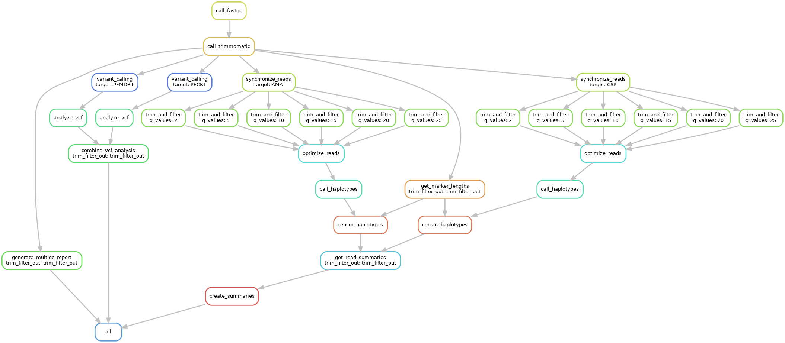

# Running the haplotype calling pipeline with Snakemake

Overview: Using human or mosquito samples from Webuye, Kenya, evaluate the extent to which there are unique haplotypes among two polymorphic gene targets: AMA, CSP.

Method: Targeted amplicon deep sequencing which produces forward and reverse fastq files for each sample.

[Snakemake](https://snakemake.readthedocs.io/en/stable) is a workflow manager
that enables massively parallel and reproducible
analyses.
Snakemake is a suitable tool to use when you can break a workflow down into
discrete steps, with each step having input and output files.

We provide this example workflow as a template to get started running the pipeline with Snakemake.
To adjust to your specific data, you can customize the config.yaml file.

For more details on Snakemake, see the
[Snakemake tutorial](https://snakemake.readthedocs.io/en/stable/tutorial/tutorial.html).

## The Workflow

The [`Snakefile`](Snakefile) contains rules which define the output files we want and how to make them.
Snakemake automatically builds a directed acyclic graph (DAG) of jobs to figure
out the dependencies of each of the rules and what order to run them in.
This workflow processes the data set by cleaning the sequencing reads for each target set in the config file, finding the optimal quality score, performing haplotype calling, and censoring the haplotypes to render numerous data analysis outputs, resulting in a final table that contains the resulting haplotypes after censoring.



The DAG shows how calls can be run in parallel if Snakemake is allowed to run more than one job at a time. Here, the pipeline is parallelized by being called with two targets, AMA and CSP, and six quality scores (2, 5, 10, 15, 20, 25) at the same time.

`call_fastqc` uses FastQC to perform quality control on the raw reads and allow for visualization of the quality of the reads.

`call_trimmomatic` cleans and filters the raw reads. It uses CutAdapt to trim the primers and adapter sequences from sequencing reads and Trimmomatic to quality filter reads if the average of every 4 nucleotides had a Phred Quality Score < 15 or was less than 80 nucleotides long.

`clean_sequencing_reads` cleans, filters, and maps the raw reads. It uses BBmap to map all reads from the reference sequences, CutAdapt to trim the primers and adapter sequences from sequencing reads, and Trimmomatic to quality filter reads if the average of every 4 nucleotides had a Phred Quality Score < 15 or was less than 80 nucleotides long. This is the first step in read processing on the cluster.

`trim_and_filter` filters and trims the forward and reverse reads using the DADA2 program and outputs them into a `filtered` folder.

`optimize_reads` finds the quality score that produces the highest number of read counts and uses only the filtered reads created using that quality score.

`call_haplotypes` calls haplotypes for your target(s) and writes the results out into a reads table.

`censor_haplotypes` censors falsely detected haplotypes. Censoring criteria is applied in this order:
1. Haplotypes that occur in < 250 of the sample’s reads are removed. You can change this criteria in the config file ("read_depth").
2. Haplotypes that occur in < 3% of the sample’s reads are removed. You can change this criteria in the config file ("proportion").
3. Haplotypes that are a different length than the majority of haplotypes (300 nucleotides for pfama1, 288 nucleotides for pfcsp. You can change the length in the config file ("haplotype_length").
4. For haplotypes that have 1 SNP difference, occur in the same sample, and have a > 8 times read depth difference between them within that sample, removed the hapltoype with the lower read depth from that sample. You can change the 8 to a different read depth ratio in the config file ("read_depth_ratio").
5. If a haplotype is defined by a single variant position that is only variable within that haplotype, then it is removed.

## Quick Start

1. Clone or download this repo.

    ``` sh
    git clone https://github.com/kathiehuang/haplotype_calling_pipeline.git
    ```
    Alternatively, if you're viewing this on GitHub,
    you can click the green `Use this template` button to create
    your own version of the repo on GitHub, then clone it.

1. Install the dependencies.

    1. If you don't have conda yet, we recommend installing 
       [miniconda](https://docs.conda.io/en/latest/miniconda.html). 
       
       If you use a Macbook that has an M1 Chip, you will need to install Rosetta2:

       ``` sh
       softwareupdate --install-rosetta
       ```

       Download the x86-64 bit version of miniconda instead of the M1 version.
       
    1. Next, install [mamba](https://mamba.readthedocs.io/en/latest/), 
       a fast drop-in replacement for conda:
       
       ``` sh
       conda install mamba -n base -c conda-forge
       ```
       
    1. Finally, create the environment and activate it:
    
       ``` sh
       mamba env create -f environment.yaml # you only have to do this once
       conda activate haplotype_calling # you have to do this every time
       ```
       
    - Alternatively, you can install the dependencies listed in
    [`environment.yaml`](environment.yaml) however you like.

1. Edit the configuration file [`config.yaml`](config.yaml).
    - `target_file`: the TSV File that contains a table with your target(s) and length(s) of majority of haplotypes. We used [`targets.tsv`](targets.tsv) for reference.
    - `refs`: the path to the folder containing reference sequences for the polymorphic gene target that will be used to map the raw reads to the appropriate gene targets of interest.
    - `pair1`: the path to the folder containing the forward reads.
    - `pair2`: the path to the folder containing the reverse reads.
    - `forward`: the path to the file with the list of forward primers.
    - `rev`: the path to the file with the list of reverse primers.
    - `out`: the name of desired output folder.
    - `truncQ_values`: values of truncQ to be used in the filterAndTrim function to find the optimal truncQ value
    - `cutoff`: cutoff for which samples with less than this number of reads after sampling should be removed.
    - `seed`: seed of R's random number generator for the purpose of obtaining a reproducible random result.
    - `read_depth`: cutoff for which haplotypes that occur in less than this amount of the sample reads should be removed.
    - `proportion`: cutoff for which haplotypes that occur in less than this percentage of the sample reads should be removed.
    - `read_depth_ratio`: cutoff for which haplotypes that have 1 SNP difference, occur in the same sample, and have a greater than this amount times read depth difference between them within that sample with the lower read depth should be removed

    You can leave these options as-is if you'd like to first make sure the
    workflow runs without error on your machine before using your own dataset
    and custom parameters.

1. Modify your adapters files to notify CutAdapt that you want to use linked adapters.

    A linked adapter combines a 5’ and a 3’ adapter, so we use this if a sequence is surrounded by a 5’ and a 3’ adapter and we want to remove both adapters. Linked adapters aren't required for this pipeline to run, but we found that for our data, using linked adapters produced better results.

    Linked adapters are specified as two sequences separated by ... (three dots), with the second sequence being the reverse complement of the reverse primer for the forward primer and the reverse complement of the forward primer for the reverse primer. We use -g instead of -a (5' vs 3' adapters) when calling CutAdapt, which causes both adapters to be required, even if they are not anchored. However, we want the non-anchored adapters to be optional. You can mark each adapter explicitly as required or optional using the search parameters `required` and `optional`. As a result, we add the `optional` parameter to the end of the sequence after the three dots. This is what our `forwardPrimers.fasta` file looks like for CSP:

    ``` sh
    >Pfcsp-f
    TTAAGGAACAAGAAGGATAATACCA...CATTTCGGTTTGGGTCATTT;optional
    ```

    And our `reversePrimers.fasta` file looks like this:

    ``` sh
    >Pfcsp-r_rc
    AAATGACCCAAACCGAAATG...TGGTATTATCCTTCTTGTTCCTTAA;optional
    ```

    If you choose to forgo using linked adapters, this is what your adapters file would look like:

    ``` sh
    >Pfcsp-f
    TTAAGGAACAAGAAGGATAATACCA
    ```

    ``` sh
    >Pfcsp-r_rc
    AAATGACCCAAACCGAAATG
    ```

    For more information about the linked adapters parameter, visit the [CutAdapt documentation.](https://cutadapt.readthedocs.io/en/stable/guide.html#linked-adapters-combined-5-and-3-adapter)

1. Do a dry run to make sure the snakemake workflow is valid.

    ``` sh
    snakemake -n
    ```

1. Run the workflow.

    Run it **locally** with:
    ``` sh
    snakemake --cores {NCORES} # NCORES = number of cores, ie. without parallelization use snakemake --cores 1. With our parameters, we typically run it with 12 cores.
    ```

    To run the workflow on an **HPC with Slurm**:

    1. Edit your email address (`YOUR_EMAIL_HERE`) in:

        - [`scripts/submit_slurm.sh`](scripts/submit_slurm.sh)

    1. Submit the snakemake workflow with:

        ``` sh
        sbatch scripts/submit_slurm.sh
        ```

        Slurm output files will be written to `logs/`. You will receive an email when the job is finished.

## Usage Examples

Below shows what output files looked like after running this pipeline with a small sample of haplotypes.

`call_fastqc` should produce an output folder for each target. Within the output folder, there should be a `fastqc_in` folder with FastQC reports for each input fastq file. This allows you to visualize and assess quality collectively across all reads within a sample. To open the .zip files, download and extract the files.

Example of FastQC output files for a single sample: `BF1_S1_L001_R1_001_fastqc.html`, `BF1_S1_L001_R1_001_fastqc.zip`, `BF1_S1_L001_R2_001_fastqc.html`, `BF1_S1_L001_R2_001_fastqc.zip`

`call_trimmomatic` should add a `trim` folder within the output directory containing the results from the Trimmomatic program, which filters poor quality reads and trims poor quality bases from your samples and produces statistical summaries.

The `trim` folder contains four folders labeled `1`, `2`, `singleton`, and `summaries`. As an example, the `trim/1` folder contains a `BF1.1.fastq.gz` file, the `trim/2` folder contains a `BF1.2.fastq.gz` file, the `singleton` folder contains `BF1.1_unpaired.fq.gz` and `BF1.2_unpaired.fq.gz` files, and the `summaries` folder contains a `BF1.summary` file.

`synchronize_reads` should produce three folders within the output directory: `fastq/all_samples`, `ref`, and `results`. `all_samples` contains the cleaned and mapped fastq files, `ref` contains information about the indexes produced and referenced by the BBSplit program, and `results` contains summaries of the BBSplit call on each sample.

As an example, the `fastq/all_samples` folder contains `BF1_AMA_1.fastq.gz` and `BF1_AMA_2.fastq.gz` files, the `ref` folder contains a `genome/1` folder that has `merged_ref_64917.fa.gz`, `namelist.txt`, and `reflist.txt` files, and `results` contains a `BF1.txt` file.

`trim_and_filter` should produce a `haplotype_output` folder in the output directory that contains a summary for read trimming and filtering for each q value (which can be changed in the config file), `{target}_{q_values}_trimAndFilterTable`. It also produces a `{target}/read_count` file that lists the read counts for each q value.

After running the pipeline on a small sample of haplotypes, the AMA trim and filter table for a q value of 2 looked like this:

|                      | reads.in | reads.out |
|----------------------|----------|-----------|
| BF1_AMA_1.fastq.gz   | 13072    | 8297      |
| BF10_AMA_1.fastq.gz  | 14875    | 9243      |
| BF2_AMA_1.fastq.gz   | 15269    | 10247     |
| BF3_AMA_1.fastq.gz   | 10116    | 5075      |
| BF4_AMA_1.fastq.gz   | 13672    | 8852      |
| BF5_AMA_1.fastq.gz   | 12650    | 7720      |
| BF6_AMA_1.fastq.gz   | 14591    | 9754      |
| BF7_AMA_1.fastq.gz   | 12760    | 8208      |
| BF8_AMA_1.fastq.gz   | 11474    | 7382      |
| BF9_AMA_1.fastq.gz   | 12432    | 6318      |

And the AMA read count table looked like this:

|   |   |
|---|---|
| 25 | 76565  |
| 15 | 103295 |
| 20 | 103224 |
| 2  | 81096  |
| 5  | 81096  |
| 10 | 116036 |

`optimize_reads` should produce 3 files in the `haplotype_output` folder: `{target}_final_q_value`, `{target}_max_read_count`, and `{target}_finalTrimAndFilterTable`.
- `{target}_final_q_value`: contains the quality score that produced the highest number of read counts.
- `{target}_max_read_count`: contains the value of the highest number of read counts—the read count associated with the optimal quality score.
- `{target}_finalTrimAndFilterTable`: contains the trim and filter table that was created with the optimal quality score.

With our small sample, the AMA final q value was:
`10`

The AMA max read count was:
`116036`

And the final trim and filter table looked like this:

|                     | reads.in | reads.out |
|---------------------|----------|-----------|
| BF1_AMA_1.fastq.gz  | 13072    | 11777     |
| BF10_AMA_1.fastq.gz | 14875    | 13384     |
| BF2_AMA_1.fastq.gz  | 15269    | 13718     |
| BF3_AMA_1.fastq.gz  | 10116    | 8491      |
| BF4_AMA_1.fastq.gz  | 13672    | 12226     |
| BF5_AMA_1.fastq.gz  | 12650    | 11119     |
| BF6_AMA_1.fastq.gz  | 14591    | 13085     |
| BF7_AMA_1.fastq.gz  | 12760    | 11350     |
| BF8_AMA_1.fastq.gz  | 11474    | 10326     |
| BF9_AMA_1.fastq.gz  | 12432    | 10560     |

`call_haplotypes` should add two files to the `haplotype_output` folder: `{target}_haplotypes.rds` and `{target}_trackReadsThroughPipeline.csv`. 
- `{target}_haplotypes.rds`: R file that stores the haplotype results data set for further manipulation in `censor_haplotypes`. 
- `{target}_trackReadsThroughPipeline.csv`: tracks the reads, looking at the number of reads that made it through each step of the pipeline.

With our small sample, the trackReadsThroughPipeline table looked like this:

|      | merged | tabled | nonchim |
|------|--------|--------|---------|
| BF1  | 11768  | 11768  | 11768   |
| BF10 | 13377  | 13377  | 13377   |
| BF2  | 13681  | 13681  | 13681   |
| BF3  | 8450   | 8450   | 8450    |
| BF4  | 12211  | 12211  | 12211   |
| BF5  | 10584  | 10584  | 10360   |
| BF6  | 13078  | 13078  | 13078   |
| BF7  | 11049  | 11049  | 10773   |
| BF8  | 10314  | 10314  | 10314   |
| BF9  | 10549  | 10549  | 10549   |

`censor_haplotypes` should add six files to the haplotype_output folder: `{target}_haplotype_table_precensored.csv`, `{target}_snps_between_haps_within_samples.fasta`, `{target}_uniqueSeqs.fasta`, `{target}_aligned_seqs.fasta`, `{target}_uniqueSeqs_final_censored.fasta`, and `{target}_haplotype_table_censored_final_version.csv`. 
- `{target}_haplotype_table_precensored.csv`: outputs the haplotype data set prior to beginning the censoring process (essentially `{target}_haplotypes.rds` in a formatted csv file). 
- `{target}_snps_between_haps_within_samples.fasta`: fasta file of the haplotypes after the first three steps of the censoring process are completed. This is used to tally up the number of SNPs between all haplotype pairings. 
- `{target}_uniqueSeqs.fasta`: fasta file of the haplotypes after the fourth step of the censoring process is completed. 
- `{target}_aligned_seqs.fasta`: fasta file of the sequences after alignment. 
- `{target}_uniqueSeqs_final_censored.fasta`: fasta file of the haplotype results after all five steps of the censoring process are completed. 
- `{target}_haplotype_table_censored_final_version.csv`: outputs the final censored haplotype data set in a formatted table.

With our small sample, the haplotype_table_precensored file looked like this:

| H1    | H2    | H3    | H4    | H5    | H6    | H7    | MiSeq.ID |
|-------|-------|-------|-------|-------|-------|-------|----------|
| 0     | 0     | 0     | 0     | 11768 | 0     | 0     | BF1      |
| 0     | 0     | 0     | 13377 | 0     | 0     | 0     | BF10     |
| 13665 | 0     | 0     | 16    | 0     | 0     | 0     | BF2      |
| 0     | 8450  | 0     | 0     | 0     | 0     | 0     | BF3      |
| 18    | 12186 | 7     | 0     | 0     | 0     | 0     | BF4      |
| 268   | 0     | 9862  | 0     | 0     | 230   | 0     | BF5      |
| 13078 | 0     | 0     | 0     | 0     | 0     | 0     | BF6      |
| 0     | 603   | 10170 | 0     | 0     | 0     | 0     | BF7      |
| 0     | 0     | 0     | 0     | 0     | 10314 | 0     | BF8      |
| 51    | 0     | 0     | 0     | 0     | 0     | 10498 | BF9      |

The snps_between_haps_within_samples file looked like this:
```
>Seq1
GTAAAGGTATAATTATTGAGAATTCAAATACTACTTTTTTAACACCGGTAGCTACGGGAAATCAATATTTAAAAGATGGAGGTTTTGCTTTTCCTCCAACAGAACCTCATATGTCACCAATGACATTAGATGAAATGAGACATTTTTATAAAGATAATAAATATGTAAAAAATTTAGATGAATTGACTTTATGTTCAAGACATGCAGGAAATATGATTCCAGATAATGATAAAAATTCAAATTATAAATATCCAGCTGTTTATGATGACAAAGATAAAAAGTGTCATATATTATATATTG
>Seq2
GTAAAGGTATAATTATTGAGAATTCAAATACTACTTTTTTAAAACCGGTAGCTACGGGAAATCAAGATTTAAAAGATGGAGGTTTTGCTTTTCCTCCAACAAATCCTCTTATATCACCAATGACATTAAATGGTATGAGAGATTTTTATAAAAATAATGAATATGTAAAAAATTTAGATGAATTGACTTTATGTTCAAGACATGCAGGAAATATGAATCCAGATAATGATGAAAATTCAAATTATAAATATCCAGCTGTTTATGATGACAAAGATAAAAAGTGTCATATATTATATATTG
>Seq3
GTAAAGGTATAATTATTGAGAATTCAAATACTACTTTTTTAAAACCGGTAGCTACGGGAAATCAAGATTTAAAAGATGGAGGTTTTGCTTTTCCTCCAACAGAACCTCTTATATCACCAATGACATTAGATGATATGAGAGATTTTTATAAAAATAATGAATATGTAAAAAATTTAGATGAATTGACTTTATGTTCAAGACATGCAGGAAATATGAATCCAGATAATGATCAAAATTCAAATTATAAATATCCAGCTGTTTATGATTACGAAGATAAAAAGTGTCATATATTATATATTG
>Seq4
GTAAAGGTATAATTATTGAGAATTCAAATACTACTTTTTTAACACCGGTAGCTACGGGAAAACAAGATTTAAAAGATGGAGGTTTTGCTTTTCCTCCAACAAATCCTCTTATATCACCAATGACATTAGATCATATGAGAGATTTTTATAAAAAAAATGAATATGTAAAAAATTTAGATGAATTGACTTTATGTTCAAGACATGCAGGAAATATGAATCCAGATAATGATGAAAATTCAAATTATAAATATCCAGCTGTTTATGATTACAAAGATAAAAAGTGTCATATATTATATATTG
>Seq5
GTAAAGGTATAATTATTGAGAATTCAAATACTACTTTTTTAAAACCGGTAGCTACGGGAAATCAAGATTTAAAAGATGGAGGTTTTGCTTTTCCTCCAACAGAACCTCTTATATCACCAATGACATTAAATGGTATGAGAGATTTATATAAAAATAATGAAGATGTAAAAAATTTAGATGAATTGACTTTATGTTCAAGACATGCAGGAAATATGAATCCAGATAATGATAAAAATTCAAATTATAAATATCCAGCTGTTTATGATGACAAAAATAAAAAGTGTCATATATTATATATTG
>Seq6
GTAAAGGTATAATTATTGAGAATTCAAAAACTACTTTTTTAACACCGGTAGCTACGGAAAATCAAGATTTAAAAGATGGAGGTTTTGCTTTTCCTCCAACAAATCCTCCTATGTCACCAATGACATTAAATGGTATGAGAGATTTATATAAAAATAATGAATATGTAAAAAATTTAGATGAATTGACTTTATGTTCAAGACATGCAGGAAATATGAATCCAGATAATGATAAAAATTCAAATTATAAATATCCAGCTGTTTATGATTACAATGATAATAAGTGTCATATATTATATATTG
>Seq7
GTAAAGGTATAATTATTGAGAATTCAAATACTACTTTTTTAAAACCGGTAGCTACGGGAAATCAAGATTTAAAAGATGGAGGTTTTGCTTTTCCTCCAACAGAACCTCTTATATCACCAATGACATTAAATGGTATGAGAGATTTTTATAAAAATAATGAATATGTAAAAAATTTAGATGAATTGACTTTATGTTCAAGACATGCAGGAAATATGAATCCAGATAAGGATGAAAATTCAAATTATAAATATCCAGCTGTTTATGATGACAAAGATAAAAAGTGTCATATATTATATATTG
```

The uniqueSeqs file looked like this: 
```
>Seq1
GTAAAGGTATAATTATTGAGAATTCAAATACTACTTTTTTAACACCGGTAGCTACGGGAAATCAATATTTAAAAGATGGAGGTTTTGCTTTTCCTCCAACAGAACCTCATATGTCACCAATGACATTAGATGAAATGAGACATTTTTATAAAGATAATAAATATGTAAAAAATTTAGATGAATTGACTTTATGTTCAAGACATGCAGGAAATATGATTCCAGATAATGATAAAAATTCAAATTATAAATATCCAGCTGTTTATGATGACAAAGATAAAAAGTGTCATATATTATATATTG
>Seq2
GTAAAGGTATAATTATTGAGAATTCAAATACTACTTTTTTAAAACCGGTAGCTACGGGAAATCAAGATTTAAAAGATGGAGGTTTTGCTTTTCCTCCAACAAATCCTCTTATATCACCAATGACATTAAATGGTATGAGAGATTTTTATAAAAATAATGAATATGTAAAAAATTTAGATGAATTGACTTTATGTTCAAGACATGCAGGAAATATGAATCCAGATAATGATGAAAATTCAAATTATAAATATCCAGCTGTTTATGATGACAAAGATAAAAAGTGTCATATATTATATATTG
>Seq3
GTAAAGGTATAATTATTGAGAATTCAAATACTACTTTTTTAAAACCGGTAGCTACGGGAAATCAAGATTTAAAAGATGGAGGTTTTGCTTTTCCTCCAACAGAACCTCTTATATCACCAATGACATTAGATGATATGAGAGATTTTTATAAAAATAATGAATATGTAAAAAATTTAGATGAATTGACTTTATGTTCAAGACATGCAGGAAATATGAATCCAGATAATGATCAAAATTCAAATTATAAATATCCAGCTGTTTATGATTACGAAGATAAAAAGTGTCATATATTATATATTG
>Seq4
GTAAAGGTATAATTATTGAGAATTCAAATACTACTTTTTTAACACCGGTAGCTACGGGAAAACAAGATTTAAAAGATGGAGGTTTTGCTTTTCCTCCAACAAATCCTCTTATATCACCAATGACATTAGATCATATGAGAGATTTTTATAAAAAAAATGAATATGTAAAAAATTTAGATGAATTGACTTTATGTTCAAGACATGCAGGAAATATGAATCCAGATAATGATGAAAATTCAAATTATAAATATCCAGCTGTTTATGATTACAAAGATAAAAAGTGTCATATATTATATATTG
>Seq5
GTAAAGGTATAATTATTGAGAATTCAAATACTACTTTTTTAAAACCGGTAGCTACGGGAAATCAAGATTTAAAAGATGGAGGTTTTGCTTTTCCTCCAACAGAACCTCTTATATCACCAATGACATTAAATGGTATGAGAGATTTATATAAAAATAATGAAGATGTAAAAAATTTAGATGAATTGACTTTATGTTCAAGACATGCAGGAAATATGAATCCAGATAATGATAAAAATTCAAATTATAAATATCCAGCTGTTTATGATGACAAAAATAAAAAGTGTCATATATTATATATTG
>Seq6
GTAAAGGTATAATTATTGAGAATTCAAAAACTACTTTTTTAACACCGGTAGCTACGGAAAATCAAGATTTAAAAGATGGAGGTTTTGCTTTTCCTCCAACAAATCCTCCTATGTCACCAATGACATTAAATGGTATGAGAGATTTATATAAAAATAATGAATATGTAAAAAATTTAGATGAATTGACTTTATGTTCAAGACATGCAGGAAATATGAATCCAGATAATGATAAAAATTCAAATTATAAATATCCAGCTGTTTATGATTACAATGATAATAAGTGTCATATATTATATATTG
>Seq7
GTAAAGGTATAATTATTGAGAATTCAAATACTACTTTTTTAAAACCGGTAGCTACGGGAAATCAAGATTTAAAAGATGGAGGTTTTGCTTTTCCTCCAACAGAACCTCTTATATCACCAATGACATTAAATGGTATGAGAGATTTTTATAAAAATAATGAATATGTAAAAAATTTAGATGAATTGACTTTATGTTCAAGACATGCAGGAAATATGAATCCAGATAAGGATGAAAATTCAAATTATAAATATCCAGCTGTTTATGATGACAAAGATAAAAAGTGTCATATATTATATATTG
```

The aligned_seqs file looked like this:

```
>Seq5
GTAAAGGTATAATTATTGAGAATTCAAATACTACTTTTTTAAAACCGGTAGCTACGGGAAATCAAGATTTAAAAGATGGA
GGTTTTGCTTTTCCTCCAACAGAACCTCTTATATCACCAATGACATTAAATGGTATGAGAGATTTATATAAAAATAATGA
AGATGTAAAAAATTTAGATGAATTGACTTTATGTTCAAGACATGCAGGAAATATGAATCCAGATAATGATAAAAATTCAA
ATTATAAATATCCAGCTGTTTATGATGACAAAAATAAAAAGTGTCATATATTATATATTG
>Seq6
GTAAAGGTATAATTATTGAGAATTCAAAAACTACTTTTTTAACACCGGTAGCTACGGAAAATCAAGATTTAAAAGATGGA
GGTTTTGCTTTTCCTCCAACAAATCCTCCTATGTCACCAATGACATTAAATGGTATGAGAGATTTATATAAAAATAATGA
ATATGTAAAAAATTTAGATGAATTGACTTTATGTTCAAGACATGCAGGAAATATGAATCCAGATAATGATAAAAATTCAA
ATTATAAATATCCAGCTGTTTATGATTACAATGATAATAAGTGTCATATATTATATATTG
>Seq4
GTAAAGGTATAATTATTGAGAATTCAAATACTACTTTTTTAACACCGGTAGCTACGGGAAAACAAGATTTAAAAGATGGA
GGTTTTGCTTTTCCTCCAACAAATCCTCTTATATCACCAATGACATTAGATCATATGAGAGATTTTTATAAAAAAAATGA
ATATGTAAAAAATTTAGATGAATTGACTTTATGTTCAAGACATGCAGGAAATATGAATCCAGATAATGATGAAAATTCAA
ATTATAAATATCCAGCTGTTTATGATTACAAAGATAAAAAGTGTCATATATTATATATTG
>Seq1
GTAAAGGTATAATTATTGAGAATTCAAATACTACTTTTTTAACACCGGTAGCTACGGGAAATCAATATTTAAAAGATGGA
GGTTTTGCTTTTCCTCCAACAGAACCTCATATGTCACCAATGACATTAGATGAAATGAGACATTTTTATAAAGATAATAA
ATATGTAAAAAATTTAGATGAATTGACTTTATGTTCAAGACATGCAGGAAATATGATTCCAGATAATGATAAAAATTCAA
ATTATAAATATCCAGCTGTTTATGATGACAAAGATAAAAAGTGTCATATATTATATATTG
>Seq2
GTAAAGGTATAATTATTGAGAATTCAAATACTACTTTTTTAAAACCGGTAGCTACGGGAAATCAAGATTTAAAAGATGGA
GGTTTTGCTTTTCCTCCAACAAATCCTCTTATATCACCAATGACATTAAATGGTATGAGAGATTTTTATAAAAATAATGA
ATATGTAAAAAATTTAGATGAATTGACTTTATGTTCAAGACATGCAGGAAATATGAATCCAGATAATGATGAAAATTCAA
ATTATAAATATCCAGCTGTTTATGATGACAAAGATAAAAAGTGTCATATATTATATATTG
>Seq3
GTAAAGGTATAATTATTGAGAATTCAAATACTACTTTTTTAAAACCGGTAGCTACGGGAAATCAAGATTTAAAAGATGGA
GGTTTTGCTTTTCCTCCAACAGAACCTCTTATATCACCAATGACATTAGATGATATGAGAGATTTTTATAAAAATAATGA
ATATGTAAAAAATTTAGATGAATTGACTTTATGTTCAAGACATGCAGGAAATATGAATCCAGATAATGATCAAAATTCAA
ATTATAAATATCCAGCTGTTTATGATTACGAAGATAAAAAGTGTCATATATTATATATTG
>Seq7
GTAAAGGTATAATTATTGAGAATTCAAATACTACTTTTTTAAAACCGGTAGCTACGGGAAATCAAGATTTAAAAGATGGA
GGTTTTGCTTTTCCTCCAACAGAACCTCTTATATCACCAATGACATTAAATGGTATGAGAGATTTTTATAAAAATAATGA
ATATGTAAAAAATTTAGATGAATTGACTTTATGTTCAAGACATGCAGGAAATATGAATCCAGATAAGGATGAAAATTCAA
ATTATAAATATCCAGCTGTTTATGATGACAAAGATAAAAAGTGTCATATATTATATATTG
```

The uniqueSeqs_final_censored file looked like this:
```
>Seq1
GTAAAGGTATAATTATTGAGAATTCAAATACTACTTTTTTAAAACCGGTAGCTACGGGAAATCAAGATTTAAAAGATGGAGGTTTTGCTTTTCCTCCAACAAATCCTCTTATATCACCAATGACATTAAATGGTATGAGAGATTTTTATAAAAATAATGAATATGTAAAAAATTTAGATGAATTGACTTTATGTTCAAGACATGCAGGAAATATGAATCCAGATAATGATGAAAATTCAAATTATAAATATCCAGCTGTTTATGATGACAAAGATAAAAAGTGTCATATATTATATATTG
```

And the haplotype_table_censored_final table looked like this:

| H2    | MiSeq.ID |
|-------|----------|
| 8450  | BF3      |
| 12186 | BF4      |
| 603   | BF7      |

## More resources

- [Snakemake tutorial](https://snakemake.readthedocs.io/en/stable/tutorial/tutorial.html)
- [conda user guide](https://docs.conda.io/projects/conda/en/latest/user-guide/getting-started.html)